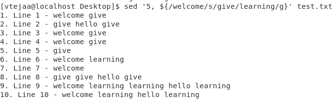

# Activity 5

### 1.Create a shell script to print the HTTP error code of guvi.in & print, the success/failure message based on the error code response

**Code**

```bash
#!/bin/bang
URL=https://www.guvi.in
status_code=$(curl --write-out %{http_code} --silent --output /dev/null $URL)

if [[ $status_code -eq 200 ]]
then
	echo "Sucess, Reached to guvi.in"
else
	echo "Failure, Not reached to server guvi.in"
fi
```

**Output Screenshot:**


### 2.Given a file, replace all occurrence of the word ""give"" with ""learning"" from the 5th line till the end in only those lines that contain the word "welcome"

**Test file**


**Command**

```bash
sed '5, ${/welcome/s/give/learning/g}' test.txt
```

**Output Screenshot:**


